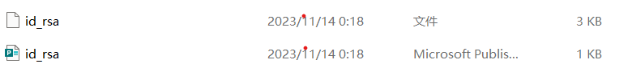

# 阶段二笔记

## 学习背景

在csdn这位大佬的文章指导以及同学的帮助下，终于创建了远程库。

[文章链接]([Git教程 Git Bash详细教程-CSDN博客](https://blog.csdn.net/qq_36667170/article/details/79085301?ops_request_misc=%7B%22request%5Fid%22%3A%22169989139616800182111181%22%2C%22scm%22%3A%2220140713.130102334..%22%7D&request_id=169989139616800182111181&biz_id=0&utm_medium=distribute.pc_search_result.none-task-blog-2~all~top_positive~default-1-79085301-null-null.142^v96^pc_search_result_base6&utm_term=git bash&spm=1018.2226.3001.4187))

## 遇到的问题

在与github账户进行密钥连接的时候，首先需要从git bash上创建SSH Key，输入指令后会生成一个`.ssh`文件夹，其中应该会有`id_rsa`和`id_rsa.pub`这两个文件，然而如下图

`.pub`文件不见了，而且第二个文件也打不开，我被他的名字迷惑了，以为他是上一个文件的不同版本，然后就去尝试别的指令但还是没有`.pub`文件，直到我的同学说让我用记事本打开试一下，发现他就是我需要的密钥😭😭😭

## git常见指令

**git init**表示初始化本地库

**git add 文件名**表示将某个文件添加至暂存区

**git add .**表示将所有文件添加至暂存区

**git commit -m"xxx"xxx**表示自己对此次提交进行的备注或标注

**git push origin master**表示实现由本地到远程仓库的推送

**git pull 仓库名称**表示将远程仓库的变动同步到本地库